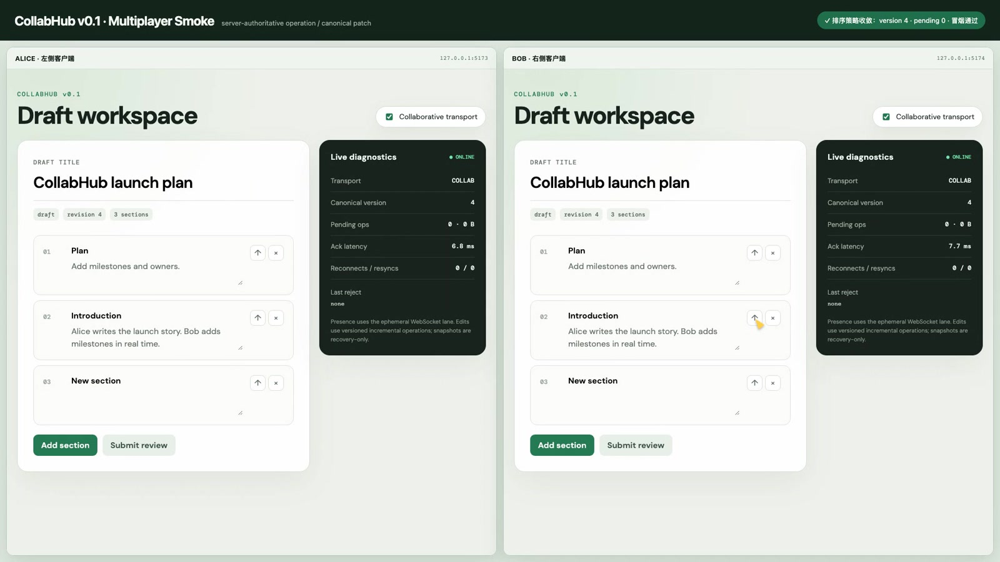

# CollabHub

中心权威、业务无关、可扩展的多人协同内核。

宿主保留自己的领域模型，通过 operation、canonical patch 与 Domain Pack 接入。

## Features

- **Server authoritative**：服务端定序、校验并发布 canonical patch。
- **Host-owned domain**：不要求宿主迁移到 CRDT 数据模型。
- **Pluggable strategies**：支持 LWW、实体生命周期、列表排序与严格事务。
- **Reliable recovery**：幂等 operation、pending replay、WAL 与 snapshot recovery。
- **Single writer**：协同会话内阻止 REST 与 room 双写。
- **Ephemeral presence**：presence 不进入 WAL、snapshot 或文档版本。

## 案例

### 1. TODO List

最小协同示例，覆盖任务增删、状态修改、排序与在线成员。规划中。

## 接入案例

[`examples/react-draft-app`](examples/react-draft-app) 保留原有 `DraftDocument`、`DraftStore`、`DraftCommandBus`、REST API 与 `DraftRepository`，协同依赖仅位于 adapter、composition root 与服务端 Domain Pack。

```ts
const transport: DraftCommandTransport = collabEnabled
  ? new CollabHubDraftTransport(wsUrl, actorId, clientId, draftStore)
  : new RestDraftTransport(apiUrl, draftId)

const commandBus = new DraftCommandBus(transport)
await commandBus.execute({ type: 'draft.rename', title: 'Launch plan' })

export const DraftDomainPack = defineDomainPack({
  id: 'example.draft',
  schemaVersion: '1.0',
  strategies: jsonStrategies,
  invariants: [uniqueSectionId, validDraftStatus],
  initialState: (documentId) => initialDraft(documentId),
})
```

<a href="docs/assets/collabhub-v0.1-smoke.mp4">
  
</a>

[播放双客户端冒烟视频](docs/assets/collabhub-v0.1-smoke.mp4)

## 仓库结构

```text
packages/
  protocol/        协议与 wire types
  client-core/     pending、重连与 recovery
  server-core/     定序、pipeline、WAL 与 snapshot
  strategy-sdk/    Strategy 与 Domain Pack SPI
  domain-json/     默认 JSON strategies
  testkit/         trace 与 conformance helpers
examples/
  react-draft-app/ REST baseline 与协同接入样板
docs/              架构、接入与验收文档
```

## 开发手册

要求 Node.js 22+、pnpm 10+。

```bash
pnpm install
pnpm dev       # server + Alice + Bob
pnpm check     # build + tests + benchmark
pnpm test:e2e  # 双浏览器验收
```

| 服务 | 地址 |
|---|---|
| Server / REST / WebSocket | `http://127.0.0.1:4100` |
| Alice | `http://127.0.0.1:5173/?client=alice` |
| Bob | `http://127.0.0.1:5174/?client=bob` |

## 文档

- [架构](docs/architecture/overview.md)
- [协议与 Pipeline](docs/architecture/protocol.md)
- [接入条件](docs/integration/readiness.md)
- [React Draft 接入](docs/integration/react-draft-tutorial.md)
- [验收记录](docs/acceptance.md)
- [已知限制](docs/known-limitations.md)

## License

[Apache-2.0](LICENSE)
