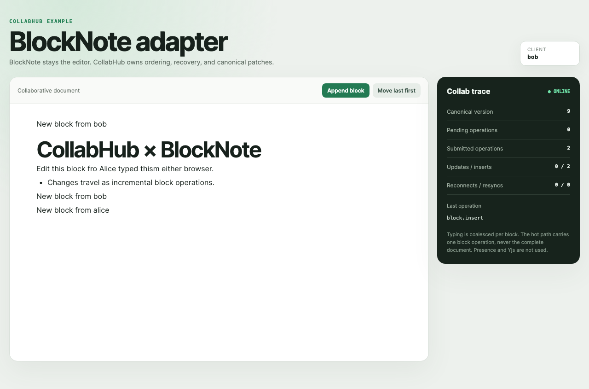

# v0.1 验收记录

日期：2026-08-27（Asia/Shanghai）  
环境：macOS arm64、Node.js v24.18.0、pnpm 10.11.0、Playwright Chromium 151.0.7922.34。

## 最终 gate

`pnpm check`：通过。

- TypeScript project references：通过。
- Vite production build：40 modules；JS 211.14 KB / 65.78 KB gzip，CSS 3.65 KB / 1.41 KB gzip。
- BlockNote Vite production build：914 modules；主 JS 1,131.76 KB / 343.38 KB gzip，CSS 243.00 KB / 38.62 KB gzip；大 chunk 警告记录为已知限制。
- Vitest：7 files / 17 tests passed。
- 1,000-section patch benchmark：1,000 samples，p95 0.014 ms，gate 4 ms，通过。

`pnpm test:e2e`：2 tests passed（9.0 s；Draft 2.8 s，BlockNote 3.9 s）。

## 真实进程与网络

最终 Playwright webServer 启动的是 `pnpm dev` 同一交付命令：

| 角色 | 最终验收 PID | 监听 |
|---|---:|---|
| Draft API + CollabHub WebSocket | 24743 | `127.0.0.1:4100`, `/collab` |
| React Alice Vite | 24721 | `127.0.0.1:5173` |
| React Bob Vite | 24727 | `127.0.0.1:5174` |

BlockNote 最终 Playwright 验收使用 `pnpm dev:blocknote`：

| 角色 | PID | 监听 |
|---|---:|---|
| BlockNote CollabHub WebSocket | 73788 | `127.0.0.1:4200`, `/collab` |
| BlockNote Alice Vite | 73748 | `127.0.0.1:5183` |
| BlockNote Bob Vite | 73772 | `127.0.0.1:5184` |

Alice 与 Bob 使用两个独立 Chromium BrowserContext，而不是一个模拟 store。Server、两个 Vite client 和浏览器均由 Playwright 在验收结束后正常回收。

## 故障 trace

最终 trace 文档：`e2e-1787813081729`。

```json
{"event":"client_connected","actorId":"alice","lastKnownVersion":0,"canonicalVersion":0,"snapshotRecovery":false}
{"event":"client_connected","actorId":"bob","lastKnownVersion":0,"canonicalVersion":0,"snapshotRecovery":false}
{"event":"operation_result","operationType":"property.set","baseVersion":0,"result":"accepted","canonicalVersion":1,"latencyMs":6.21}
{"event":"operation_result","operationType":"property.set","baseVersion":1,"result":"accepted","canonicalVersion":2,"latencyMs":3.04}
{"event":"client_connected","actorId":"alice","lastKnownVersion":1,"canonicalVersion":2,"snapshotRecovery":true}
{"event":"operation_result","operationType":"property.set","baseVersion":2,"result":"accepted","canonicalVersion":3,"latencyMs":2.26}
```

这条 trace 证明：Alice v1 断线；Bob 推进到 v2；Alice 以 `lastKnownVersion=1` 重连并收到 v2 snapshot；其 pending intent 改写 baseVersion 为 2 后重放，被接受为 v3。截图中的诊断面显示 canonical version 3、pending 0、reconnect 1、resync 0。

## BlockNote 验收

最终 trace 文档：`blocknote-e2e-1787818499184`。

```json
{"event":"client_connected","actorId":"alice","lastKnownVersion":0,"canonicalVersion":0}
{"event":"operation_result","operationType":"block.update","result":"accepted","canonicalVersion":1,"payloadBytes":265}
{"event":"operation_result","operationType":"block.insert","result":"accepted","canonicalVersion":3,"payloadBytes":310}
{"event":"client_connected","actorId":"alice","lastKnownVersion":2,"canonicalVersion":3}
{"event":"operation_result","operationType":"block.insert","result":"accepted","canonicalVersion":4,"payloadBytes":312}
{"event":"operation_result","operationType":"block.move","result":"accepted","canonicalVersion":9,"payloadBytes":70}
```

Alice 在 v2 断线；Bob 插入块推进到 v3；Alice 以 v2 重连取得 snapshot，并把离线 insert 重放为 v4。随后 5 个真实 BlockNote move transaction 推进到 v9，两端顺序一致。E2E 同时解析双方 WebSocket frame，断言 submit payload 只有单块 `block`，不存在 `document` 或 `blocks`，且远端 projection 不产生回声 update。

### 双客户端冒烟视频

[播放 26 秒视频](assets/collabhub-blocknote-smoke.mp4)：1920×1080、H.264、30 fps。Alice 与 Bob 来自两个独立 Chromium BrowserContext，鼠标移动 0.8–1.0 秒、按键间隔 92 ms；只有 Alice 在故障段断网。

录制 trace：`blocknote-smoke-1787819407857`。

```json
{"event":"alice_typing_converged","aliceVersion":"2","bobVersion":"2"}
{"event":"bob_insert_converged","aliceVersion":"3","bobVersion":"3"}
{"event":"alice_offline_pending","aliceVersion":"3","bobVersion":"3","alicePending":"1"}
{"event":"bob_advances_canonical","aliceVersion":"3","bobVersion":"4","alicePending":"1"}
{"event":"reconnect_replay_converged","aliceVersion":"5","bobVersion":"5","alicePending":"0","aliceRecovery":"1 / 0"}
{"event":"block_order_converged","aliceVersion":"10","bobVersion":"10","alicePending":"0"}
```

<p>
  
  
</p>

## 验收矩阵

| 场景 | 自动化证据 |
|---|---|
| 同属性并发 LWW | `server-core.test.ts`，两 baseVersion=0 op 收敛到服务端后到值 |
| section 并发移动 | 同上，fractional positions 唯一且顺序确定 |
| 重复投递 | 同上，duplicate=true 且版本不增加；重启恢复仍去重 |
| reject-if-stale | 同上，strict transaction rejected / staleVersion |
| resyncRequired | 同上，超过 recovery window 返回 snapshotRef |
| snapshot + WAL recovery | 同上，从 v2 snapshot 回放 v3 WAL |
| 断线重连与 pending replay | `client-core.test.ts` + 双浏览器 e2e |
| REST baseline | `draft-domain.test.ts` 与真实 REST API |
| REST/Collab transport 切换 | 双浏览器 e2e；两端退出后 REST 命令成功 |
| 防双写 | 活跃协同时 e2e 的 REST PUT 返回 409 collaborativeSessionActive |
| host import boundary | components/domain 扫描测试禁止 `@collabhub/*` |
| BlockNote 富文本增量更新 | `blocknote.spec.ts` 检查真实输入同步及 WebSocket 单块 payload |
| BlockNote 插入与排序 | 双浏览器 e2e 检查 `block.insert`、`block.move` 与最终顺序 |
| BlockNote 断线恢复 | Alice 离线 pending，Bob 推进版本，Alice snapshot recovery 后重放 |
| BlockNote 依赖边界 | components/application/domain 禁止 `@collabhub/*`；canonical domain/server pack 禁止 `@blocknote/*` |

## 可复现命令

```bash
pnpm install
pnpm check
pnpm test:e2e
pnpm dev
pnpm dev:blocknote
# 另开终端
pnpm record:blocknote
```
